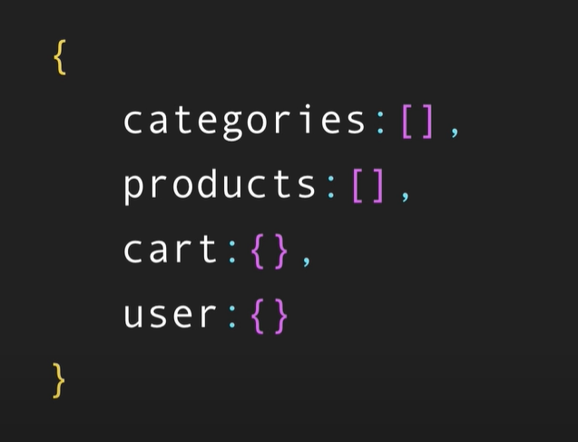
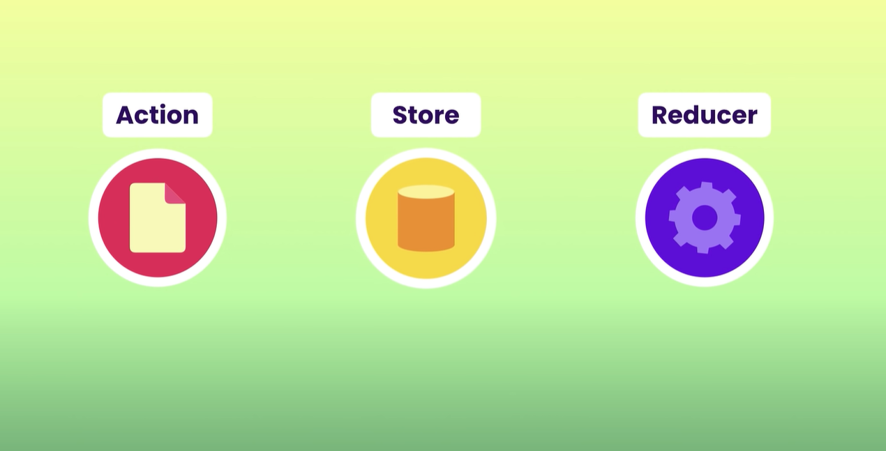
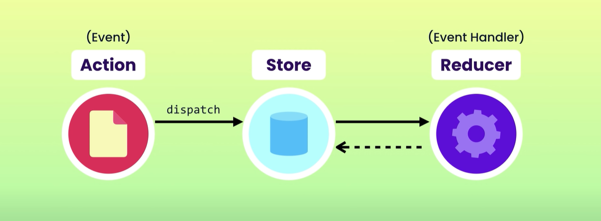
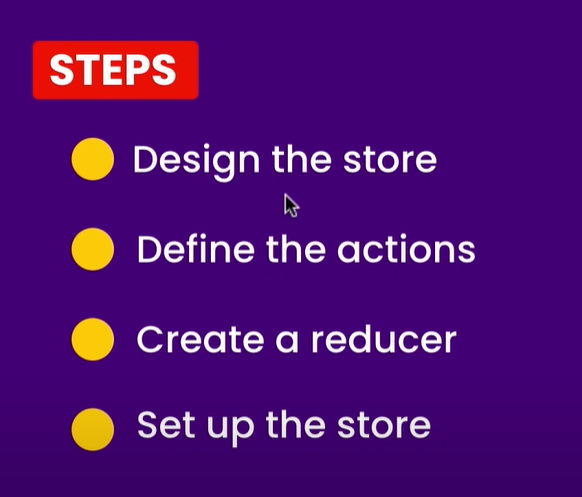

- This is a *store*
- we can say it has 4 slices
- each *reducer* is responsible for updating a specific *store*

---

## Building block of Redux:

### Store: 
- is a single JS object.
- it includes our application's **state**.

### Actions: 
- These are also JS object.
- They represent what just happened.
- They are also called *events*.

### Reducers: 
- Reducers are functions.
- We can have 1+ reducers.
- Each reducer is responsible for updating a **slice** of the store
- we can think about them as *event handlers*
- Reducers are *pure functions* means:-
    - they don't touch *global state*.
    - they don't mutate their *arguments*.
    - they don't have any *side-effects*.
- They take current store instance. 
- And return the updated one.

---

## How do these building blocks work together?

- when the user **performs** an action *(such as: adding an item to their cart)*
- we **create** an action object and **dispatch** it

    ---

- the **store** object has a *dispatched method*
- this method takes an *action*, and then **forward** this action to the *reducer*
- so by doing things like this:-
    - we do not call the *reducer* directly
    - we just work with the *store*
    - the *store* is in charge of calling the *reducer* 
    - the *reducer* computes the *new state* and *returns* it

    ---

- then the *store* will **set** the state internally, 
- and *notify* the **UI components** about the update
- these *UI components* then *pull out* the updated data and *refresh* themselves

---

## Cool things we can do with Redux:
- we can **log** every action, means:-
    - it *shows* every action that has been *dispatched*.
    - and *how* this *state* has changed
- we can very easily implement **undo** and **redo** mechanism

---

## Bug Tracker App - using Redux:
1. on the ui we're gonna have a *text box*.
2. this text box is for entering *information* about the bug we just discover.
3. we can -
    - add this bug to a list
    - remove a bug
    - mark a bug as resolved
    - change the status to *in-progress*

---

## 4 steps we need to follow while building Redux app:

